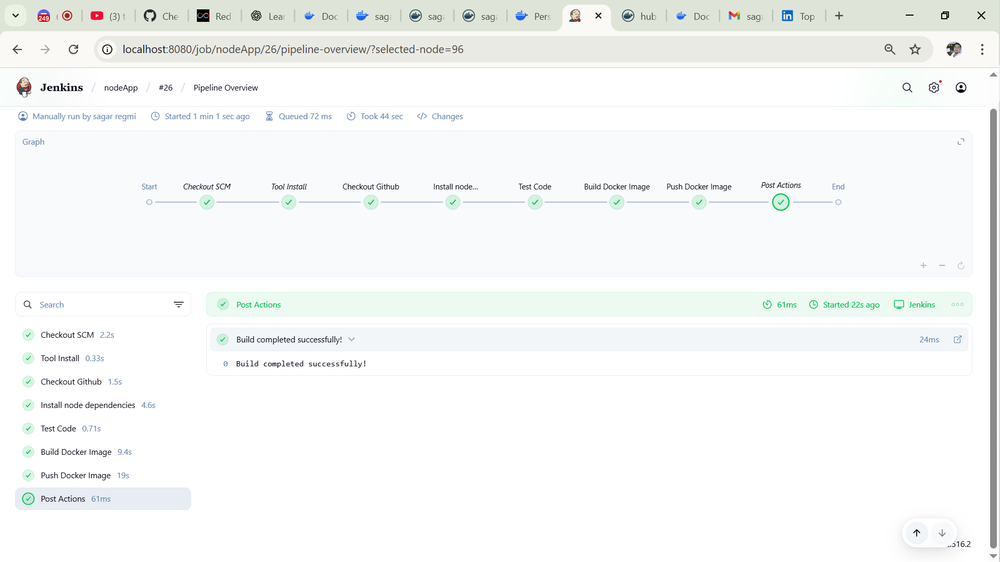
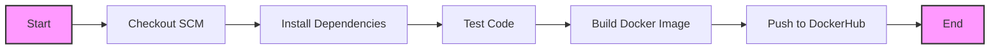

# Node.js CI/CD Pipeline with Jenkins and Docker

This repository documents my learning journey in implementing a CI/CD pipeline using Jenkins, Docker, and soon Kubernetes. Here's what I've accomplished and learned so far.

## What I've Learned

### 1. Jenkins Pipeline Setup
- Set up Jenkins server and configured necessary plugins
- Learned about Jenkins pipeline syntax and structure
- Implemented a multi-stage pipeline using Jenkinsfile
- Configured NodeJS tool in Jenkins for npm commands

### 2. Source Control Integration
- Connected Jenkins with GitHub repository
- Set up Git credentials in Jenkins using `credentialsId`
- Learned about branch management and webhook triggers

### 3. Node.js Application CI
- Automated dependency installation with `npm install`
- Implemented automated testing with `npm test`
- Learned about Jenkins workspace management
- Understanding of build environment configuration

### 4. Docker Integration
- Created Dockerfile for Node.js application
- Learned Docker image building through Jenkins
- Implemented image tagging with build numbers and latest
- Set up DockerHub authentication using tokens
- Mastered Docker push commands in Jenkins pipeline

## Current Pipeline Implementation

### Pipeline Visualization



### Pipeline Flow Diagram



### Current Pipeline Stages

1. **Source Code Checkout**
   ```groovy
   git branch: 'main', credentialsId: 'jen-doc-git', 
   url: 'https://github.com/sagarregmi2057/nodejs-dockerhub-jenkins-pipeline'
   ```
   - Learned about Git integration
   - Understanding of Jenkins credentials management

2. **Dependencies Installation**
   ```groovy
   sh 'npm install'
   ```
   - Mastered npm in CI environment
   - Learned about Node.js tool configuration

3. **Testing**
   ```groovy
   sh 'npm test'
   ```
   - Understanding of automated testing
   - Test result interpretation

4. **Docker Image Building**
   ```groovy
   script {
       def img = docker.build("saga99/nodeimage:${BUILD_NUMBER}")
       img.tag("latest")
   }
   ```
   - Learned Docker image versioning
   - Understanding of build variables

5. **DockerHub Publishing**
   ```groovy
   script {
       sh """
       echo "$DOCKERHUB_TOKEN" | docker login -u saga99 --password-stdin
       docker push saga99/nodeimage:${BUILD_NUMBER}
       docker push saga99/nodeimage:latest
       """
   }
   ```
   - Mastered DockerHub integration
   - Learned secure credential handling

## Challenges Overcome

1. **Jenkins Configuration**
   - Successfully configured Jenkins plugins
   - Learned about tool management in Jenkins

2. **Docker Integration**
   - Resolved Docker permission issues
   - Learned about Docker daemon configuration

3. **Pipeline Syntax**
   - Mastered Groovy script basics
   - Understood pipeline directive usage

## Next Steps: Kubernetes Integration

I'm planning to extend this pipeline with Kubernetes deployment:

### Planned Additions
1. **Pull Docker Image in Kubernetes**
   - Create Kubernetes deployment manifests
   - Set up image pull secrets
   - Configure deployment strategy

2. **Kubernetes Deployment**
   - Create deployment configurations
   - Set up service definitions
   - Configure ingress rules

3. **Required Kubernetes Components**
   ```yaml
   # Coming soon: deployment.yaml
   apiVersion: apps/v1
   kind: Deployment
   metadata:
     name: nodejs-app
   # ... configuration to be added
   ```

## Current Setup Requirements

- Jenkins server with:
  - NodeJS plugin
  - Docker Pipeline plugin
  - Git plugin
- DockerHub account
- Docker installed on Jenkins server

## Useful Commands I've Learned

```bash
# Jenkins CLI
jenkins-cli.jar safe-restart
jenkins-cli.jar list-plugins

# Docker Commands
docker build -t myapp .
docker push myapp:latest
docker login -u username

# Pipeline Commands
jenkins-cli.jar replay-pipeline
```

## Resources That Helped Me

1. Jenkins Pipeline Documentation
2. Docker Official Documentation
3. Node.js Best Practices
4. Jenkins Community Forums

## Notes to Self

- Always verify DockerHub credentials before pipeline runs
- Keep track of image versions
- Regular cleanup of old Docker images
- Monitor Jenkins workspace storage

This project is continuously evolving as I learn more about DevOps practices and tools.